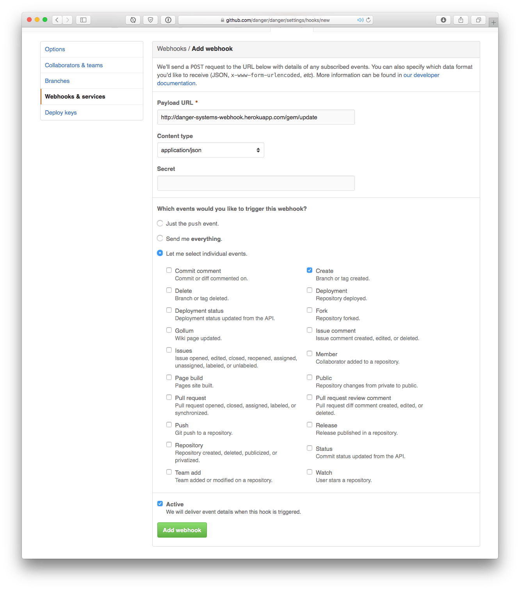

# danger.systems
The website generator for danger.systems, which is staticly generated to gh-pages

# Key Components

### plugins.json
### danger.systems
### danger-systems-webhook.herokuapp.com


To install:
``` sh
git clone https://github.com/danger/danger.systems
cd danger.systems
```

### plugins.json

The master list of all plugins to show in Danger.Systems, right now it is just the name of your plugin on rubygems.

If you'd like to add a new plugin (**awesome**) this is where you want to put it.

We'll be checking for whether you get useful metadata when you run `danger plugins lint [gem_name]` for your plugin, so please take the time to add all the extra metadata. You can see a reference [plugin here](https://github.com/dbgrandi/danger-prose) (and [a class](https://github.com/dbgrandi/danger-prose/blob/master/lib/danger_plugin.rb)). This is considered the central source of truth with respect to public plugins for Danger.

### example_oss_.json

It's hard to cover all the use cases of Danger, so rather than trying to do that, we're instead going to pull the Dangerfiles from different repos and show them in the Dangerfile guide.

### danger.systems

The static generator for the site.

It is a similar concept [to CocoaPods.org](https://github.com/cocoapods/cocoapods.org), in that there is a collection of generated data that come from Rake tasks. This data is then used to generate the web page.

The website's data is generate from `rake generate` which pulls out plugins, then grabs the gems and generates the documentation.

You can run a copy of the static site via:

``` sh
bundle install
bundle exec rake generate
# You may need to re-run `bundle install` here
bundle exec rake serve
```

### danger-systems-webhook.herokuapp.com

This is a web service, whose job is to listen out for webhook notificatiosn for new tags on any danger-plugin.
It will trigger a call to generate the new version of danger.systems, and deploy that on gh-pages. It does this by triggering new builds on this repo from Travis CI.

You can add `http://danger-systems-webhook.herokuapp.com/gem/update` as webhook for new tags, in order to have Danger always be up-to-date in documentation on the website.

You can find the webhooks settings page at: `https://github.com/[your name]/[your repo]/settings/hooks/new`



You can run a copy of the static site via:

``` sh
bundle
bundle exec foreman start
```

# Deployment

* The static site is deployed via Travis-CI, here's the [.travis.yml](.travis.yml).
* The webhooks site is deployed via Heroku, it is set to automatically re-deploy when a new commit is sent to master.